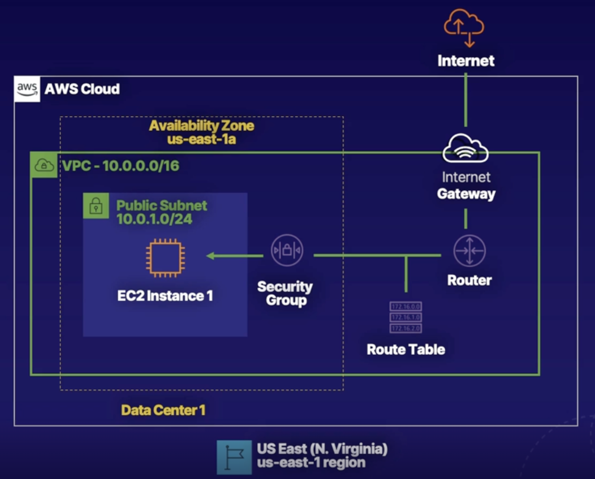

In this lab, we will build the following infrastructure.

1. Create a custom VPC.
2. Subnets.
3. Routes.
4. Configure **Internet Gateway**.
5. Launch an **EC2** in a security group.

## Create VPC

1. Go to the VPC dashboard by searching in the search bar.
2. Click on "your VPC" in the left menu.
3. Click on **create VPC**
4. Give it a name.
5. Enter a CIDR block range.
   1. Whenever you create a VPC, you must specify a range of IP addresses for it. We do that by entering **10.0.0.0/16**
6. Select **No IPV6** CIDR block.
7. For **Tenancy**, select default. This means we'll use shared hardware.
8. Leave the tag as it defaults to your VPC name.

## Create a Public Subnet

VPCs contain subnets, or isolated local networks. We will launch the EC2 instance in the subnet.

1. From the VPC dashboard's left menu, click on **Subnets**.
2. Click **create subnet**.
3. Associate your Subnet with our previously created VPC.
4. Give the subnet a name. (My-public-subnet).
5. Associate it with an availability zone.
6. Give it a CIDR block range
   1. Enter **10.0.0.0/24**
7. Leave the default tag.
8. Click **create subnet**.

##### To make our subnet public, we must expose it to the internet.

## Make Subnet Public.

1. Select our Subnet.
2. Click on **actions**.
3. Click on **Modify auto-assign IP settings**.
4. Click on **Enable auto-assign IPv4 address**.
5. Click **save**.

## Configure Internet Gateway.

An Internet Gateway enables communication over the internet.

1. From the VPC dashboard's left menu, click on **Internet Gateways**.
2. Click **create internet gateway**.
3. Give it a name.
4. Leave default tags.
5. Click **create internet gateway**.

###### Now we must attach our Internet Gateway to a VPC.

1. Click on **actions**.
2. Click on **attach to VPC**.
3. Select your VPC.
4. Click **attach internet gateway**.

## Configure routing.

1. From the VPC dashboard's left menu, click on **Route Tables**.
   1. There's already a route table created.
2. Click on **create route table**.
3. Give it a name (public-route-table).
4. Associte it to a VPC you've already created.
5. Click **create route table**.
6. Click **edit routes**.
7. Add route.
8. Set destination as 0.0.0.0/0 => This means the public internet.
9. Set target to our **Internet Gateway**.
10. Click Save.
11. From the route table's settings' **Subnet associations** tab.
12. Click **Edit Subnet associations**.
13. Select our subnet.
14. **Save**.

## Launch EC2 instance in our subnet.

1. Go to the EC2 dashboard by searching in the search bar.
2. From the left menu, click on **Instances**.
3. Click **Launch instances**.
4. Choose an AMI.
5. Chose an instance type.
6. Click **review and launch**.
7. Yout instance is given a default **security group**, which is a set of rules that act as a firewall to your instance.
8. Click **launch**
9. Create and Save the key pair file for future ssh connections.
10. Click **launch instances**.
