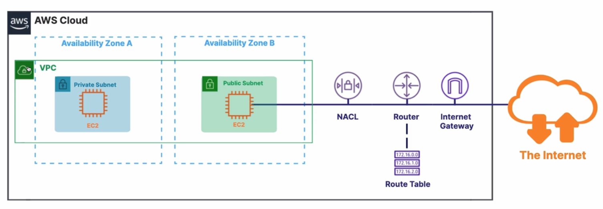
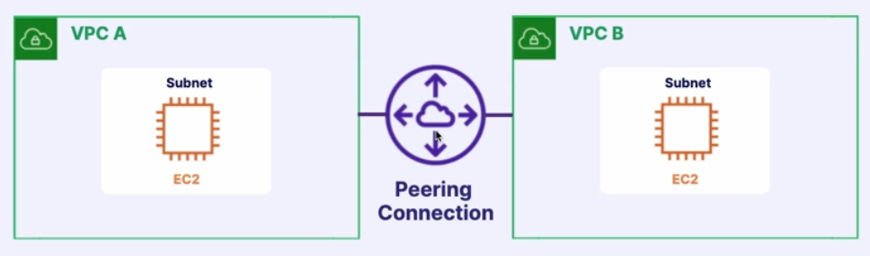
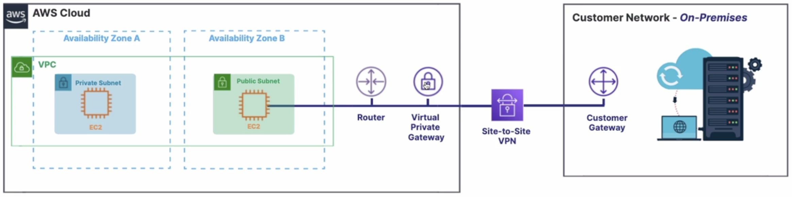

Networking is the connection of computers together to allow sharing of data between applications.

## Virtual Private Cloud (VPC)

**VPC**s allow you to create a secure private network in the AWS clou where you launch your resources.

- **Private Virtual Network**.
- Launch resources like EC2 instances inside the VPC.
- Isolate and protect resources.
- A VPC spans AZs in a single region

A **subnet** allows you to split the network inside your VPC. It's where you launch your instances like EC2.

The **private** subnet above is not accessible from the internet. You would place a database in there.

The **public** subnet is where you would store resources you would want to be accessible via the internet.

- **Access control lists (ACL)**: Ensure that proper traffic is allowed into the subnet.
- **Router & Route Table**: Define where network traffic is directed.
- **Internet Gateway**: Allows public traffic from the internet to the VPC

## VPC Peering

Is used to connect **2 VPC**s via AWS's private network to make them behave as one.

## Route 53

The **DNS** is the **Domain Name System** which is responsible for resolving a domain name to a server's` **IP** address.

**Route 53** is AWS's **DNS service** that routes users to applications.

- Allows to register your domain name.
- Performs **health checks** on AWS resources.
- Supports **hybrid** cloud architectures by allowing DNS query resolution across your **entire hybrid cloud**.

## Direct Connect

**Direct Connect** is a dedicated physical network connection from your on-premise data center to AWS.

- Dedicated **physical connection**.
- Connects your on-premise data center to AWS.
- Data travels over a private network.
- Supports a hybrid model.
- **Use cases**:
  - If you have large datasets that you need to transfer to AWS.
  - Business critical data needs to be transferred directly to AWS

## AWS Virtual Private Network

**Site-to-Site VPN** creates a secure connection between your internal networks and your AWS VPC.

- Similar to **Direct Connect**, but data travels over the **public internet**.
- Data is automatically encrypted.
- Connects your **on-premise** to AWS
- **Use cases:**
  - Moving applications to the cloud.

