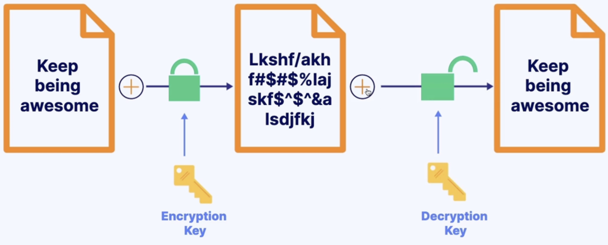

**Data in Flight** = When data is going from one location to another.

**Data at Rest** = Data that is stored for later use.

## Key Management Service (KMS)

**KMS** allows you to generate and store encryption keys.

- **Key generator**.
- Store and control keys.
- **AWS manages** encryption keys.
- Automatically **enabled for CloudTrail logs, S3 Glacier, Storage Gateway**
- **Use case:**
  - You can use **KMS** to create a **encrypted EBS module**.

## Cloud Hardware Security Module (CloudHSM)

**CloudHSM** is a hardware security module use to generate encryption keys.

- Dedicated hardware for security.
- Allows you to use your own encryption keys.
- **Use case**:
  - Maybe you need to meet compliance requirements for data security by using dedicated hardware in the cloud.

## Secrets Manager

A **secret** is something like a password.

- Allows you to store, manage, rotate and retrieve **secrets**.
- Integrates with **RDS, Redshift** and **DocumentDB**.
- **Use case**:
  - You can retrieve database credentials with a call to **Secrets Manager API**, removing the need to hardcode sensitive information in plain text within your application code.
