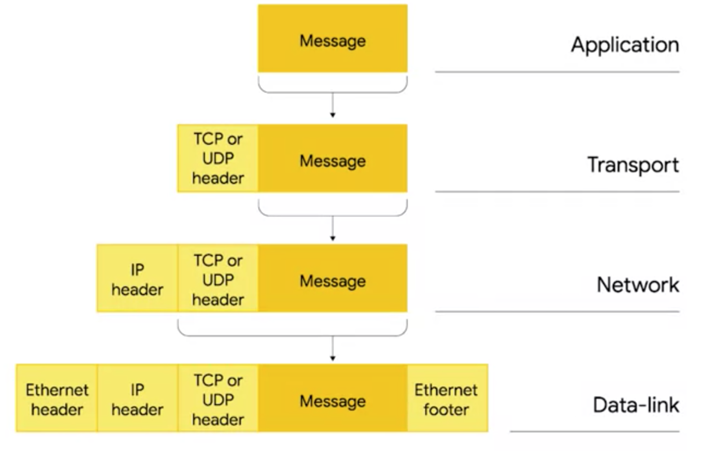
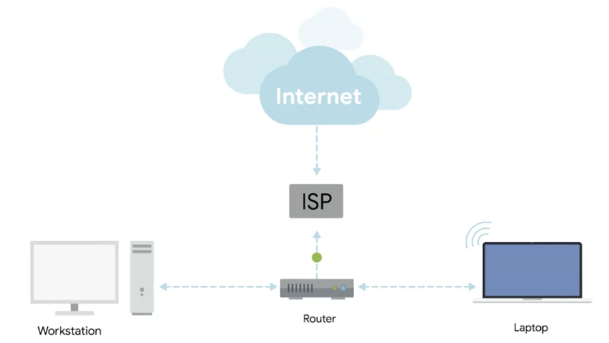
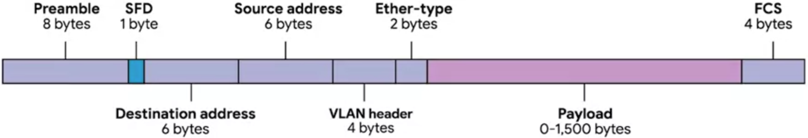
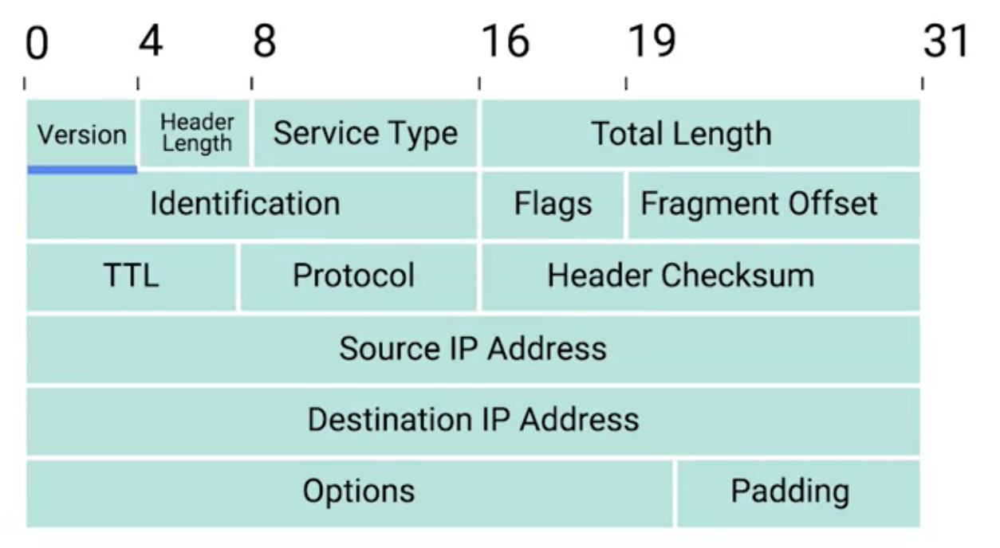
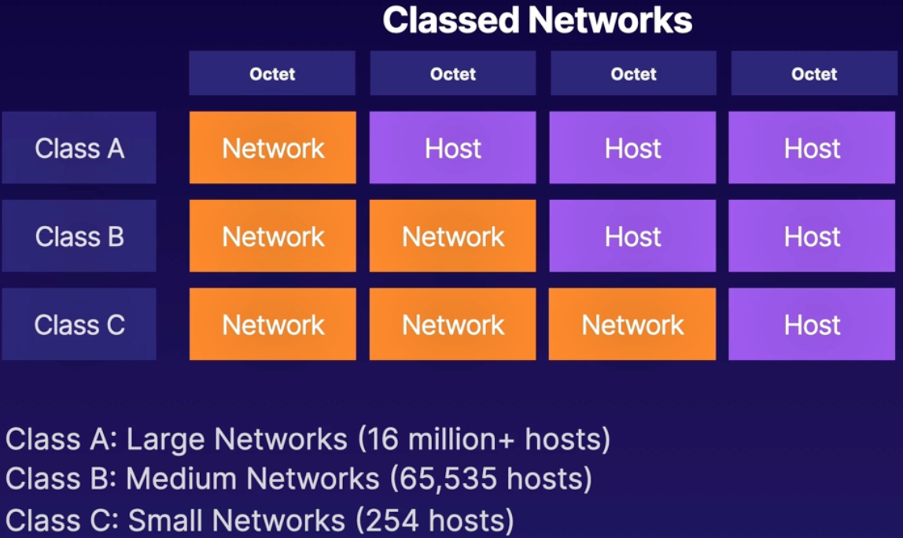

## The Open Systems Interconnection Model (OSI Model)

The **OSI** model is a conceptual model formalized in the 80's.

It's a big picture view of what's hapening from a hardware-to-application-to-hardware within a computer network.

It's made of layers, each communicating with the one above or below it, and a protocol that governs what happens at each layer.

It is used to lay out basic standards and rules for **different devices from different manufacturers to communicate on a network**.

|     | Layer       | Protocol          | Data Unit | Endpoint    |
| --- | ----------- | ----------------- | --------- | ----------- |
| 5   | Application | HTTP, HTTPS, SMTP | Messages  | n/a         |
| 4   | Transport   | TCP/UDP           | Segment   | Port number |
| 3   | Network     | IP                | Datagram  | IP Address  |
| 2   | Data Link   | Ethernet, WiFi    | Frames    | MAC address |
| 1   | Physical    | 10 Base T, 802.11 | Bits      | n/a         |

**Data packet** = An all encompassing term that represents any single set of binary data being sent across a network link.

## Devices

### Cables

Allow you to do point to point networking connection.

### Hubs (not used anymore)

It's a **physical layer device** that allows for connection from many computers at once.

All the devices connected to a HUB will end up talking to all other devices at the same time. **It's up to each system connected to the hub to determine if the incoming data is intended to them or to ignore it if it isn't**.

This creates a lot of noise on the network and creates a **collision domain**. A collision domain is a network segment where only one device can communicate at a time. **If multiple systems try sending data at the same time, the electrical pulses sent across the cable can interfere with each other.** This causes the connected computers to wait for a quiet period before they try sending their data again.

**This really slows down network communication.**

(**That's why Hubs are mainly a historical artifact at this point**).

### Switch

Is very similar to a Hub since you can connect many devices to it. But contrary to a hub which is a **layer 1** device, a switch is a **layer 2** device.

This means that a switch can inspect the content of the **Ethernet frame** and determine to which **MAC Address** the data is intended for, and send it to that computer.

### Router

While **Hubs** and **Switches** are used to connect computers on a single network, ususally referred to as a **LAN**, we often want to send and receive data to computers on another network.

A **router** is a device that knows how to **forward** data between **independent networks**. It operates at **Layer 3**. Routers can inspect **IP datagrams** to determine where to send things.

**Routers store internal tables containing information on how to route traffic between lots of different networks all over the world.**

The most common types of routers you'll see are **home routers** or **small office routers**. These routers do not have very detailed routing tables. Their purpose is to **take traffic originating from devices on your LAN and forward it to the ISP.**

Once traffic is at the ISP, a more sophisticated router determines where to send the data called a **core router**.

Not only are **Core ISP routers** connected to many other routers, they share data with each other via the **Border Gateway Protocol (BGP)**. Which is also how they learn to send traffic along the most optimal path.

## Ethernet

The primary purpose of this layer is to **abstract away** the need for any other layers **to care about the physical layer** and **what hardware** is being used.

**Media Access Control Address (MAC)** is a globally unique number to identify network cards on a device.

### Dissecting an Ethernet Frame

An **ethernet frame** is a highly structured collection of information presented in a specific order.

This way, network interfaces at the physical layer can convert a stream of bits into meaningful data.

- **Preamble**: Is a buffer between frames.
- **Start Frame Delimeter (SFD)**: Signals that the preamble is over and the actual frame contents will now follow.
- **Destination MAC address**: The hardware address of the intended recipient.
- **Source MAC addres**: Where the frame originated from.
- **Ether-type**: 16 bits long, used to describe the protocol of the contents of the frame.
- **VLAN header**: Can be found instead of the **ether-type** which indicated whether the frame itself is what's called a VLAN frame. If it is present, the **ether-type** field follows it.
  - **VLAN** = **Virtual LAN** = Is a technique that lets you have multiple logical LANs operating on the same physical equipment.
- **Payload**: The actual data being transported.
- **Frame Check Sequence (FCS)**: Checksum value for the entire frame.

## Internet Protocol

On a **Local Area Network (LAN)**, nodes can communicate with each other through their physical MAC addresses because switches can learn the MAC addresses connected to each of their port to forward transmissions appropriately.

But that doesn't scale well. There is **no way of knowing where in the world a specific MAC address will be at any point of time** .

**Adress Resolution Protocol (ARP)**, which is how nodes learn about each other's MAC addresses on a network, is not translatable to anything besides a single network segment.

**In come the Network Layer and the IP Protocol**.

**IP addresses** are comprised of four octets, and each octect is described in decimal numbers.

8 bits of data can represents all numbers from 0 to 255.

IP addresses are distributed in large sections to various organizations and companies instead of being determined by manufacturers.

This means that IP addresses are more hierarchical and easier to store data about than MAC addresses.

**IBM owns every single IP which has the number 9 as the first octet.** Which means that if an internet router needs to send data to the IP `9.0.0.1`, all it has to do is move it to one of IBM's routers, and that router takes care of the rest of the delivery process.

**IP addresses belong to networks, and not devices!** That means your laptop has a different IP assigned to it everytime it connects to a new LAN, and sometimes a different IP on the same LAN (**thanks to DHCP**).

### Dynamic Host Configuratioon Protocol (DHCP)

**DHCP** is the protocol that assigns a device an IP on a network. It is handed out by a **DHCP service ** that lives on the network.

**IP addresses assigned through DHCP are known as dynamic IPs.**

**Another type of IP address are static IPs, which are configured on a node manually.**

**Static IPs are mostly reserved for servers and Dynamic IPs for clients**.

### IP Datagram
#### Datagram Header

- **Version**: IPV4 or IPV6.
- **Header Length**: Almost always 20 bytes in length for IPV4.
- **Service Type**: Used to specify quality of service, i.e: will tell how important the datagram is, and will get priority.
- **Total Length**: Defines total length of the datagram.
- **Identification**: 16 bit number used to group messages together.
- **Flags**: Used to indicate if a datagram is allowed to be fragmented or to indicate that the datagram has already been fragmented.
- **Fragment Offset**: Process of taking a single datagram and splitting it up into several smaller datagrams.
- **TTL**: Time to live, how many router hops a datagram can traverse before it is discarded. Used to avoiid endless loops if there is a routing misconfiguration.
- **Protocol**: What transport layer protocol is being used (TCP / UDP).
- **Header Checksum**: A checksum of the entire IP datagram header.
- **Source IP Address**: IP address of source.
- **Destination IP Address**: IP address of destination.
- **Options**: Is an optional field used for testing purposes.
- **Padding**: A series of 0s used to ensure the header is the correct total size.

## Network Classes

**Public IPs are handled by large organizations and they assign out blocks of IPs based on geographic regions**.

### IPv6

**IPv6** was adopted as a standard in 2017, it is a **128 bit address**.

**There are 340 trillion trillion trillion addresses (not a typo).**

### Network Address Translation (NAT).

**NAT** will route data from your **public IP address** to your **internal IP addresses**.

This allows you to have your **private local area network (LAN)** with 10 devices on it, each with its **own IP address on the LAN**, and your **ISP (Internet Service Provider)** provides you with your own single **Public IP**, so that when different computers connect to your computer, they **first connect to your public IP** and **Network Address Translation (NAT) routes the traffic to the correct device.**

### Network Port

A **Network Port** is associated with IP address and **identifies an application or service running on a networked device**.

- The first 1023 ports are reserved for well-known services like
  - **SMTP**: port 25
  - **DNS** port 53
  - **HTTP**: port 80
  - **HTTPS**: port 443

### Subnetting

**Subnetting** is dividing a network into smaller networks.

We use a **subnet mask** to define which part of the **IP address** is used for the **network ID** and which part is used for the **host**.

#### Reasons for Subnetting

- Small networks are easier to manage than large networks.
- You get a better allocation of IP addresses in a limited range.
- With smaller networks you get better network performance.
