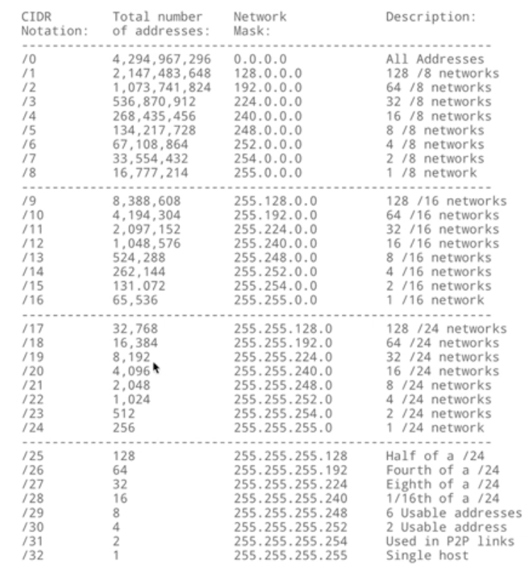

# Benefits

- Improve network performance and speed.
- Reduce network congestion.
- Enhanced Security.
- Controlled expansion.
- Maintenance & Administration.

# IPV4

Allows for ~4 Billion addresses.

Ex: `192.168.1.101`

- Is comprised of 4 Octets
- Each Octet is 8 bits, totalling 32 bits.
- Allows for numbers 0-255.

# IPV6

Allows for ~340 Trillion addresses.

Ex: `2001:0db8:85a3:0000:0000:8a2e:0370:7334`


- Is comprised of a network portion and a host portion.
- Is comprised of 128 bits.
- Each digit is hexadecimal (0-15)
- Leading zeros can be compressed.
- Groups of zeros can be removed and represented by `::`
  - `2001:db8:85a3::8a2e:370:7334`

# Address Resolution Protocol (ARP)

ARP is used to map a IP address to the device's MAC address. That's because for a Ethernet frame to travel on a network, it needs a destination MAC address.

To send data to a device on the same network, a device will brodacast a ARP request, and the device with the destination IP wil respond with a unicast of it's MAC address.

If the destination IP address is on another network, the origin device will then send it's request to the router.

# Network Masks.

The network mask designates which section of the IP address belongs to the network, and which section is for hosts. It basically determines what part of the IP is going to change on the LAN.

Ex:

- IP address: `192.168.1.101`
- Mask: `255.255.255.0`

The above mask indicates that `192.168.1` is the network, and the available addresseses are `192.168.1.0 - 192.168.1.255`

# Classess Inter-Domain Routing (CIDR)



With CIDR, we denote the mask with a `/#`, ex: `/24`

It defines the mask in binary notation. A `/24` mask represents the first 24 bits as being a `1`

Ex: `/24` is `11111111 11111111 11111111 000000` in binary, which translates to a mask of `255.255.255.0`.

Ex: `/21` is `11111111 11111111 11111000 000000` in binary, which translates to a mask of `255.255.248.0`

# Subnetting a Network.

Given a network with IP `172.100.129.147/21`, determine

- How many addresses can this network have.
- How many devices can this network host.
- It's range.

## Calculating addresses.

The formula is: `2^(number of host bits)`

We have 11 host bits `(32 - 21) = 11`

So total number of hosts = `(2^11)` -> `2048`

## Calculating hosts.

Because the first available address in a network is the network address and the last one is the broadcast address

The formula to count the number of hosts is: `addresses - 2`

So total number of hosts = `2048 - 2 = 2046`.

## Range

To determine the range of a network, we must **`AND`** the network ID and its mask's binary notation.

- `172.100.129.147` is `10101100 11001000 100000001 10010011`
- `/21` is `11111111 11111111 11111000 00000000`

```
10101100 11001000 100000001 10010011

AND

11111111 11111111 11111000 00000000

------------------------------------

10101100 11001000 10000000 00000000

```

Which is
`172.100.128.0`. This is the first address, and also the Network address.

To determine the End of the range / the broadcast address, we need to add the number of addresses to it (2048).

`2048 / 256 = 8`
`128 + 8 = 136`

Because the broadcast IP has to be odd, our broadcast ID is thus `172.100.135.255`
