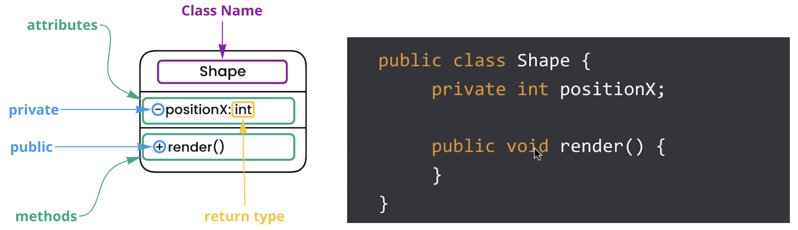
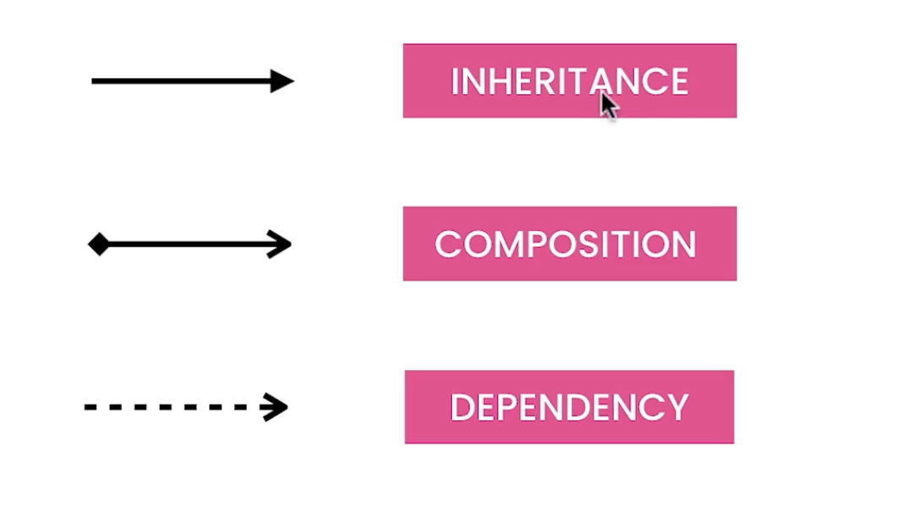
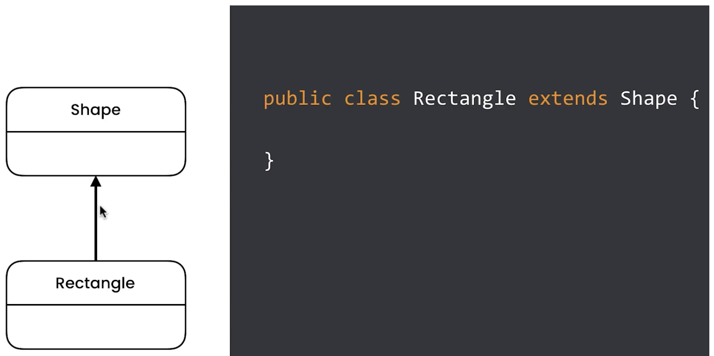
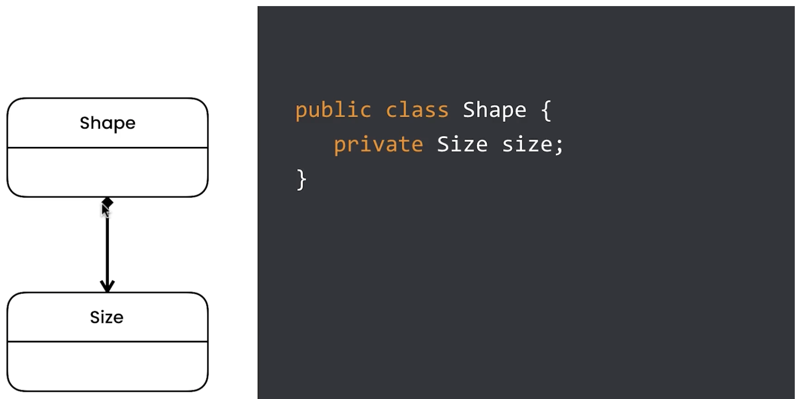
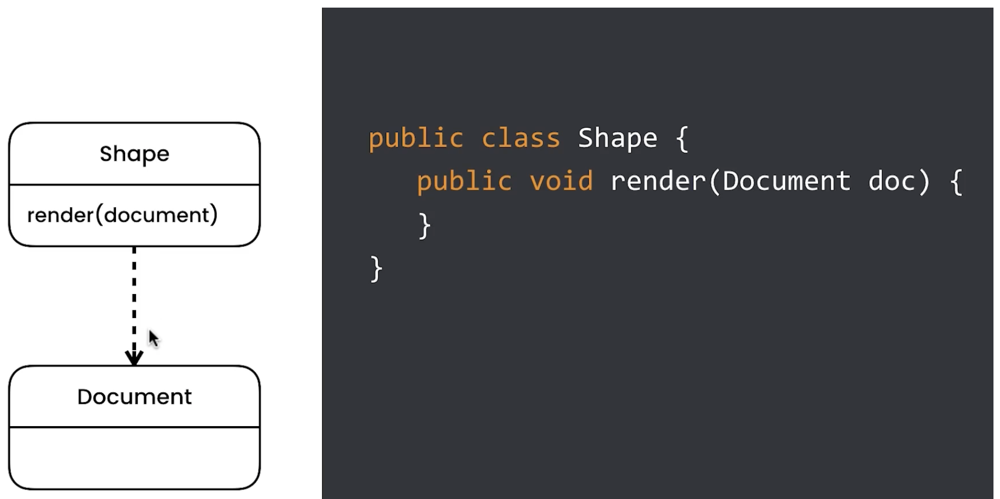

Used to model systems.

## Inheritance

When a class inherits from another.

## Composition

When a class is composed of another.

## Dependency

Somewhere in the Dependent, we have a reference to the dependee.

It could be a parameter of a method, like in the example below.

It could also be a local variable of the render method.

