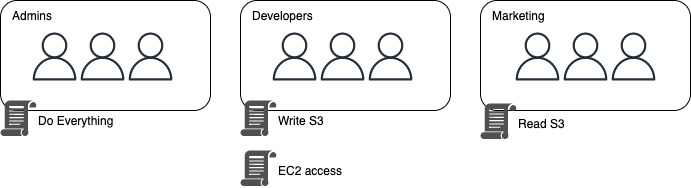

IAM entities are global. (users, groups, roles, policies)

## Assigning permissions

In AWS, we assign permissions using **policy documents**.

**Policy documents** are JSON files, for example:

We say that the holder of this **policy document** is Allowed to perform all Actions to all Resources.

```
{
    "Version": "2022-10-17",
    "Statement": [
        {
            "Effect": "Allow",
            "Action": "*",
            "Resource": "*"
        }
    ]
}
```

It is important to understand that policy documents are assigned to IAM entities, mainly groups, users and roles.

A typical setup would be one where **policy documents** are assigned to groups which users are a part of. The users will subsequently inherit those permissions which the group has.

Policies can be either custom (one which you create), or Amazon Managed (created and managed by amazon).



## Identity providers

Identity providers makes it easy to provide Single Sign On, you can link a SAML policy tied to an Active Directory Federation (Windows), and by doing that, users enter their Single Sign On username and password, and they can access the AWS platform with the same credentials.

## Notes

- IAM is global
- The **root account** is the account used to setup the AWS account, it must stay secure at all times, MFA is necessary to ensure good protection.
- New users have no permissions.
- **Access KeyID** and **secret access key** are used for programatic access and are different from username and password
  - Make sure to save them properly as you can only view them once.
- Setup **password rotation** for good protection

## 4 steps to secure your root account

- Enable MFA
- Create an admin group, give it the proper permissions
- Create users and assign them to that group
- Log in using the admin user

## Assuming a role

You can allow users to assume roles which are predefined with specific permissions.
To do that you need to:

- Create a role with the permissions you want.
- Create a policy that allows a IAM entity to assume that role.
- Assign the previous policy to an entity that wishes to gain the role's permission.
