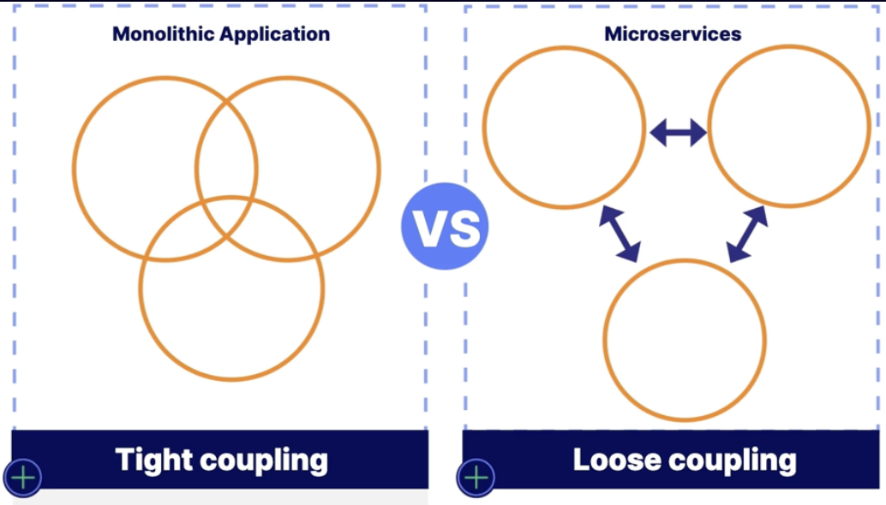
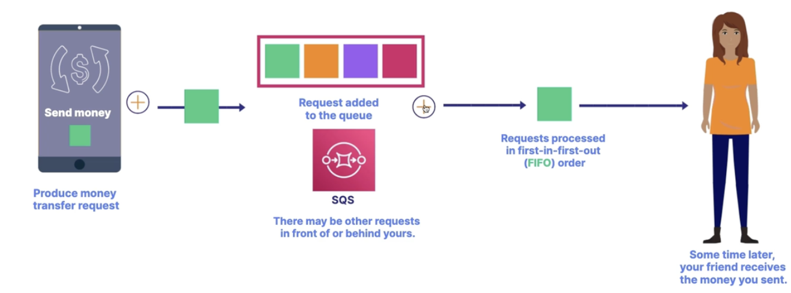

**Coupling** refers to the **interdependencies** between components of a system. **Loose coupling** helps reduce the risk of cascading failures between components.

**Queues are used to implement loosely coupled systems**.

**Messages join a queu and are processed in a FIFO order.**

## Simple Queu Service (SQS)

**SQS** is a message queuing service that allows you to build loosely coupled systems.

- Allows **component to component** communication using **messages**.

- Multiple components can add messages to the queu.

- Messages are processed in a asynchronous manner.

- **Use case**:

  - A money transfer can be built in a loosely coupled manner to handle millions of requests without blocking user interaction.

## Simple Notification Service (SNS)

**SNS** allows you to send emails and text messages from your applications.

- Can publish a message to a topic.
- Subscribers can receive messages.

- **Use cases**:
  - Used with **CloudWatch**, you can send an email when a EC2 instance's CPU usage goes above 80%.

## Simple Email Service (SES)

**SES** is an email service that allows you to send richly formatted HTML emails form your applications.

- Can send marketing emails and track open or click-through rates.
