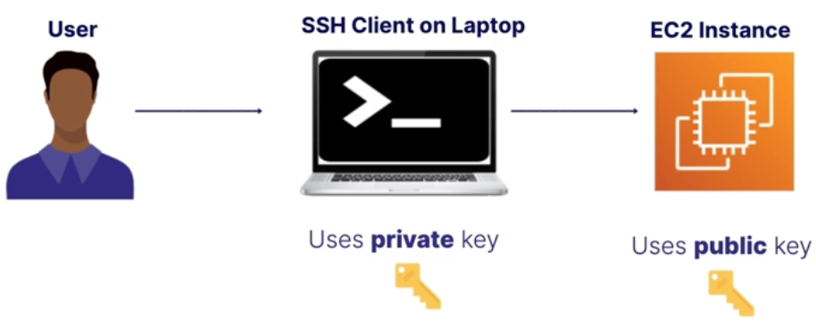

Allows you to control access to your AWS services and resources.

- Helps secure cloud resources.
- You define **who** has access.
- **What** they can do.
- It is a free **global** service.

## Identities vs Access

### Identities

**Identities** define **who** can access your resources

- Root user.
- Individual users.
- Groups.
- Roles.

### Access

**Access** defines **what** resources can do once they have access to your account.

**Access is controled by**:

- **Policies**:
- AWS managed policies.
- Customer managed policies.
- **Permissions boundries** = The scope of what a user can do.

**Authentication & Authorization**

**Authentication** = identify the identity ex: with a username and password.

**Authorization** = the level of access those identities have. Permissions are granted through **policies**.

## Users

**Users** are **identities** you create in **IAM** to represent the **person** or **application** needing to access your **AWS resources**.

- **Root** = Master user.
- **Individual users**:
  - Perform administrative tasks.
  - Access application code.
  - Provision and modify resources.
- **Applications can be users!**

**The principle of least privilege** = to give a user the minimum access required to get the job done.

For ex:

- **Developer**: Give them access to **DynamoDB, Lambda, S3**, but not Cost explorer or Organizations.
- **Project Manager**: Give them access to **Organization and Cost Explorer**, but nothing else.

### In Practice

To use the AWS CLI, users need **access keys**, and those are generated using **IAM**.

**Access keys** are composed of a **private** and **public** key, they come in **pairs**.

The **public key** lives on the resource and the **private key** on the user's machine. That will allow users with the correct **private** key to access our provisioned resources.

## Groups

A **Group** is a collection of **users**. It is a way to bundle permissions and give them to users which are part of a particular group.

**Access is assigned using policies and roles**.

You can give access to users outside of your AWS account with roles.

**You can attach a role to an instance that provides privileges to applications running on the instance. Roles help you avoid sharing long-term credentials like access keys and protect your instances from unauthorized access.**

Ex:

- **DevOps-Engineer** role that a user can temporarily assume to do a job like kickoff oa build piepline.
- **Lambda-Execution** role: **IAM is not only for users but also for AWS services** A Lambda function could need access to another service like **DynamoDB** during its execution, and uses a role with the proper permissions to do that.

## Policies

You manage permissions for **IAM users, groups, roles** by creating a policy document in **JSON** format and attaching it.

Ex: You can add a **bucket access policy** directly on a **S3 bucket** to grant **IAM users** access permissions for the bucket and the objects in it.

## IAM Best Practices

- **Enable MFA for privileged users**.
- **Implement strong password policies**.
  - Require users to change their passwords after a set period of time.
  - Dissallow use of already used passwords.
  - Rotate security credentials reularly.
- **Create individual users instead of using root.**
  - Do no use the root user for daily tasks.
- **Use roles for EC2 instances.**
  - You should use roles for applications that run on EC2 instances instead of long-term credentials like access keys.

## IAM Credential Report

The **IAM credential report** lists all users in your account and the status of their various credentials

It's often used for auditing and compliance.
