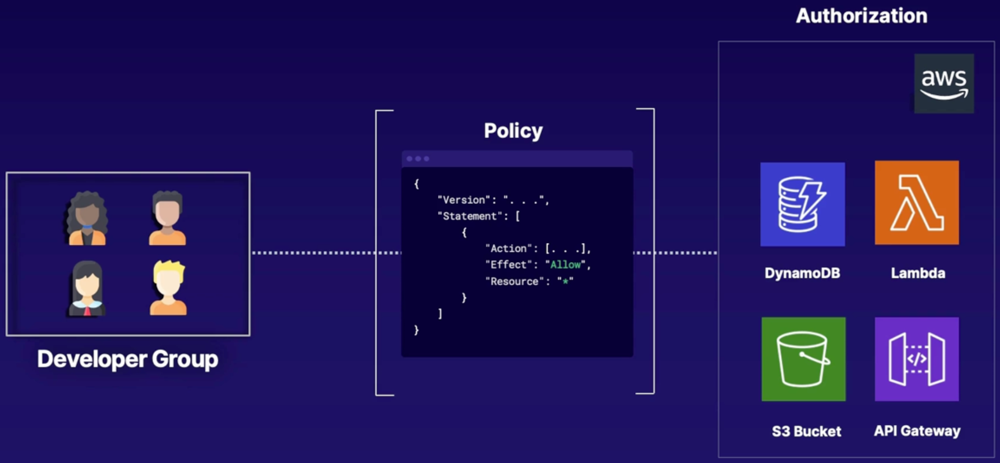

We will use **IAM** to create a **User Group,** place users in that group, then **assign permissions to that group using a custom policy**.

## Create our custom Policy

- Search for **IAM** in the search bar.

- From the left menu, click on **Policies**.
- Click on **create policy**.
- Click on **Import managed policy**. This allows us to use a predefined AWS policy and tweak it to our liking.
  - Look for "AWSLambda_FullAccess"
  - Select it and click **Import**
- We now see all the permissions form that policy.
  - Because we're going full serverless, let's remove the permissions given to EC2 instances.
- Click **next** to go to the tags, we won't give it any.
- Click **review**
- Give it a name.
- Click **create policy**

## Create a Group

- From the **IAM** dashboard.
- From the left menu, click on **Groups**.
- Click **create group**.
- Enter a name.
- We'll add users later.
- Attach the permissions's policy we just created by selecting it.
- Click **create group**.

## Assign users to a Group

- From the **User Groups** dashboard.
- Click on the group you want to manage.
- Click **add users**.
- Select the users you want to add.
- Click on **add users**.
