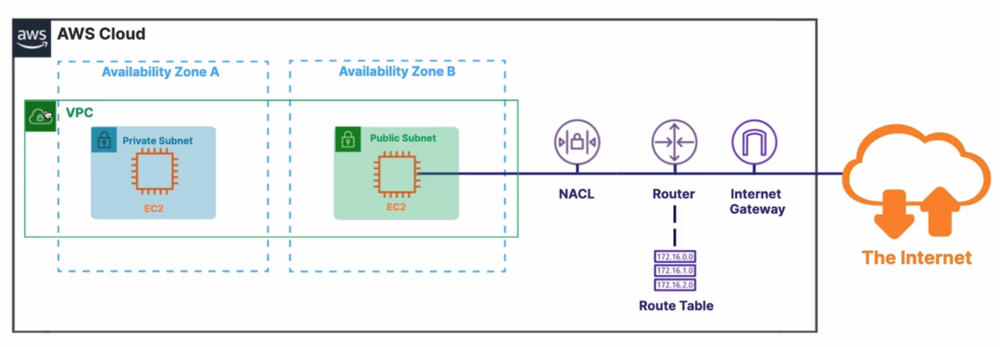
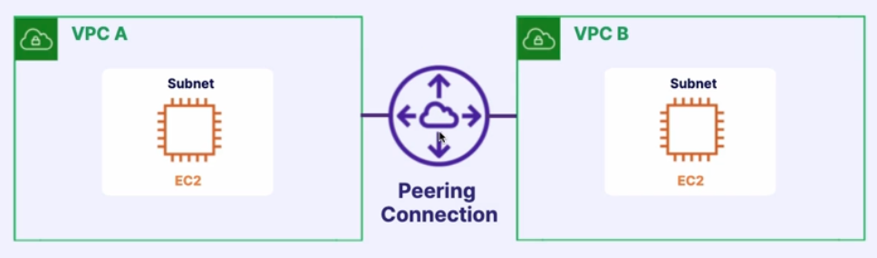

Networking is the connection of computers together to allow sharing of data between applications.

## Virtual Private Cloud (VPC)

**VPC**s allow you to create a secure private network in the AWS clou where you launch your resources.

* **Private Virtual Network**.
* Launch resources like EC2 instances inside the VPC.
* Isolate and protect resources.
* A VPC spans AZs in a single region

A **subnet** allows you to split the network inside your VPC. It's where you launch your instances like EC2. 

The **private** subnet above is not accessible from the internet. You would place a database in there.

The **public** subnet is where you would store resources you would want to be accessible via the internet.

* **Access control lists (ACL)**: Ensure that proper traffic is allowed into the subnet.
* **Router & Route Table**: Define where network traffic is directed.
* **Internet Gateway**: Allows public traffic from the internet to the VPC

## VPC Peering

Is used to connect **2 VPC**s via AWS's private network to make them behave as one.

