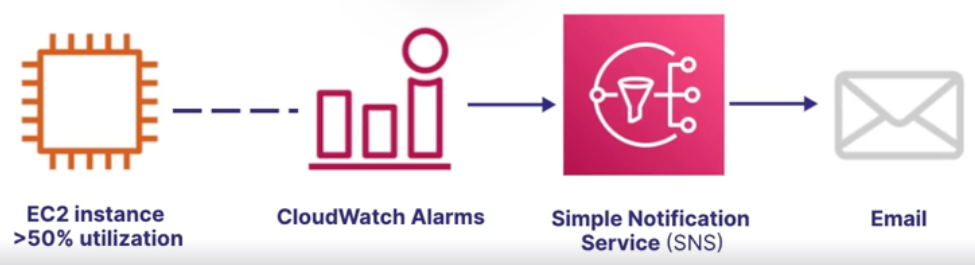

These services give you insight into how well your systems are **performing** and help you **proactively** find and resolve **errors**.

We can use these services to answer questions like:

1. Who signed in and made changes via the AWS management console.
2. What is the current load on this EC2 instance ?
3. What is the root cause of this application error ?
4. Which execution path resulted in this error ?

## CloudWatch

**CloudWatch** is a collection of services that help you monitor and observe your cloud resources.

- Collects **metrics, logs, events**.
- Detect **anomalies**.
- Visualize **logs**.
- Set **alarms**.

### CloudWatch alarms

Allows you to set alarms like a **billing alarm** to monitor your estimate AWS charges

### CloudWatch logs

Can monitor application logs like performance data for services like **lambda, EC2**.

### CloudWatch metrics

Allows you to measure **time-series** data like CPU usage and log it over time.

### CloudWatch events

Allows you to trigger events based on tracked events. Like send an email when someone logs in to the management console.

## CloudTrail

**CloudTrail** tracks user activity and API calls within your account.

- **Log** and **retain** account activity.
- Track activity through the **console, SDKs, and CLI**.
- **Identify** which **user** made changes.
- Detect unusual activity in your account.
- **Use cases:**
  - **Track time a particular event occured.**
    - Allows you to troubleshoot events over the past 90 days using the **CloudTrail history log**.
    - Track:
      - Username
      - Time
      - IP address
      - Access key used
      - Region
      - Error code
